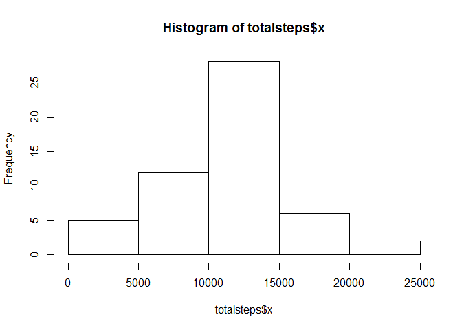
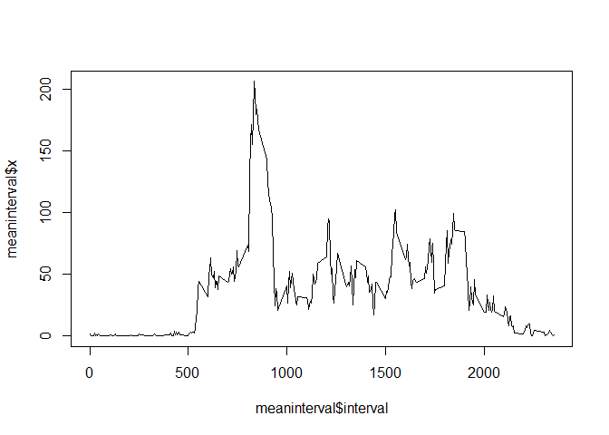
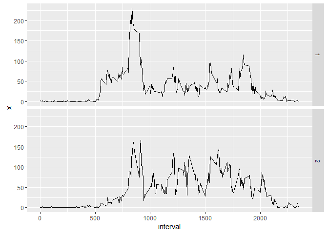

# Reproducible Research: Peer Assessment 1


## Loading and preprocessing the data

```r
require(ggplot2)
```

```
## Loading required package: ggplot2
```

```
## Warning: package 'ggplot2' was built under R version 3.2.3
```

```r
act<-read.csv("activity.csv")
```


## What is mean total number of steps taken per day?

```r
totalsteps<- aggregate(act$steps, by=list(date=act$date), FUN=sum)
hist(totalsteps$x)
```



```r
meansteps<- aggregate(act$steps, by=list(date=act$date), FUN=mean)
mediansteps<- aggregate(act$steps, by=list(date=act$date), FUN=median)
```

## What is the average daily activity pattern?

```r
act2<-act[!is.na(act$steps),]
meaninterval<- aggregate(act2$steps, by=list(interval=act2$interval), FUN=mean)
plot(meaninterval$interval, meaninterval$x, type="l")
```



## Imputing missing values

```r
for(i in 1:length(act$steps)){
        if(is.na(act$steps[i])){
                res= i%%288
                if(res == 0) res= 1
                act$steps[i] = meaninterval$x[res]
        }
}
```

## Are there differences in activity patterns between weekdays and weekends?

```r
act$date<-as.Date(act$date)
fv<-c("weekday","weekend")
fv=factor(fv)
for(i in 1:length(act$steps)){
        if(weekdays(act$date[i])=="Saturday" | weekdays(act$date[i])=="Sunday"){
                act$factor[i] = fv[2]
        }else{
                act$factor[i] = fv[1]
        }
}
meaninterval2<- aggregate(act$steps, by=list(interval=act$interval, factor=act$factor), FUN=mean)
ggplot(meaninterval2, aes(interval, x)) + geom_line() + facet_grid(factor ~ .)
```


